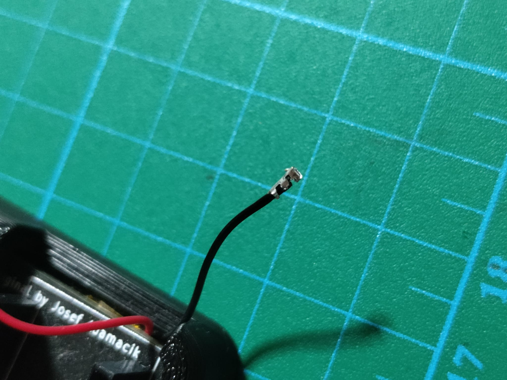
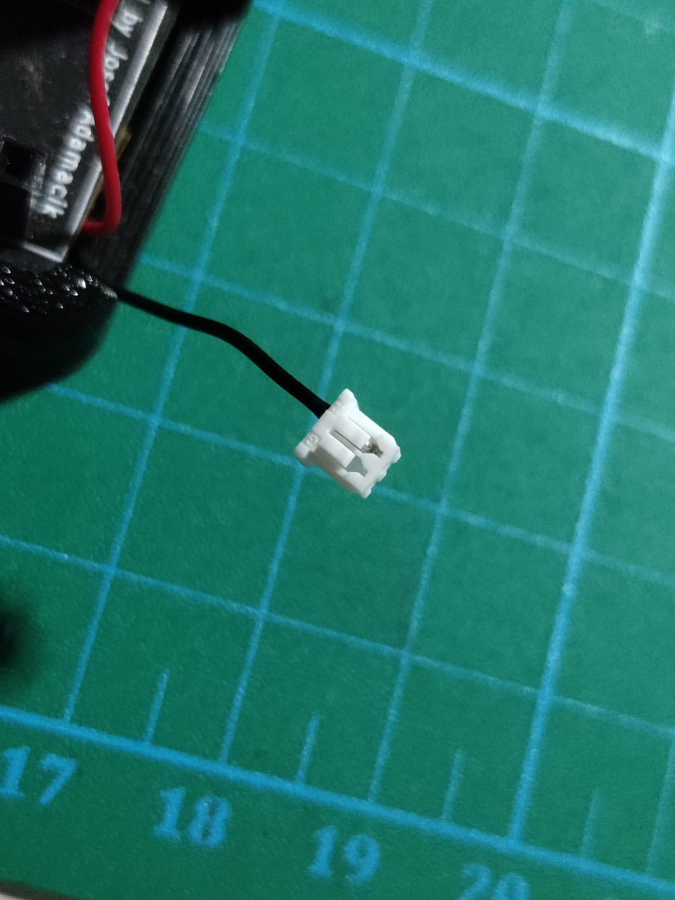
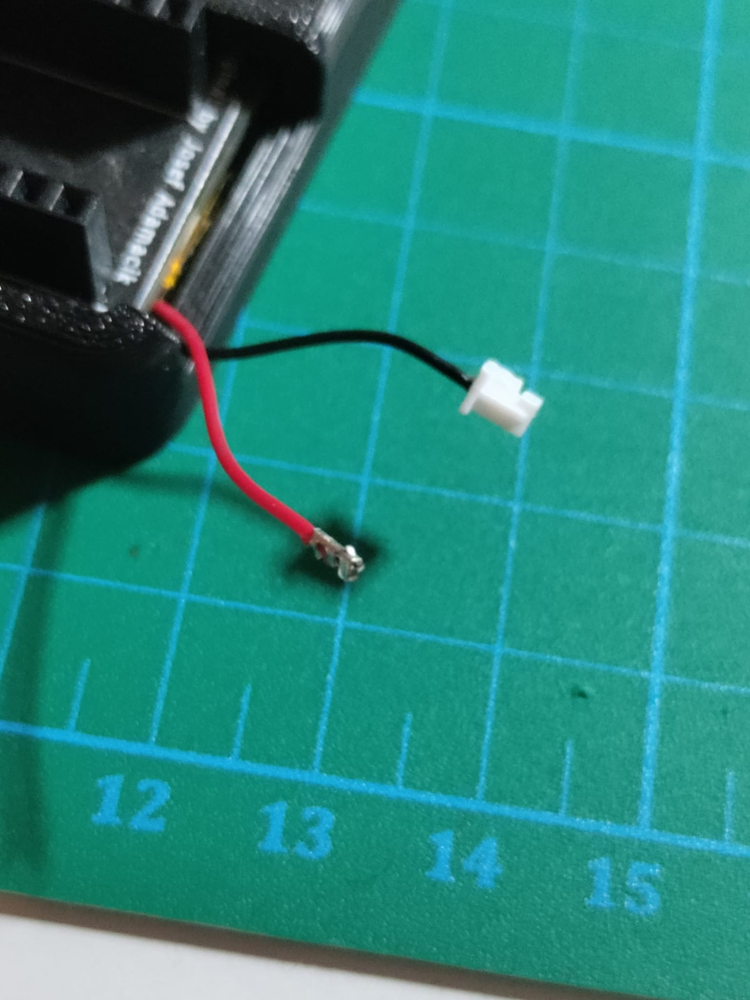
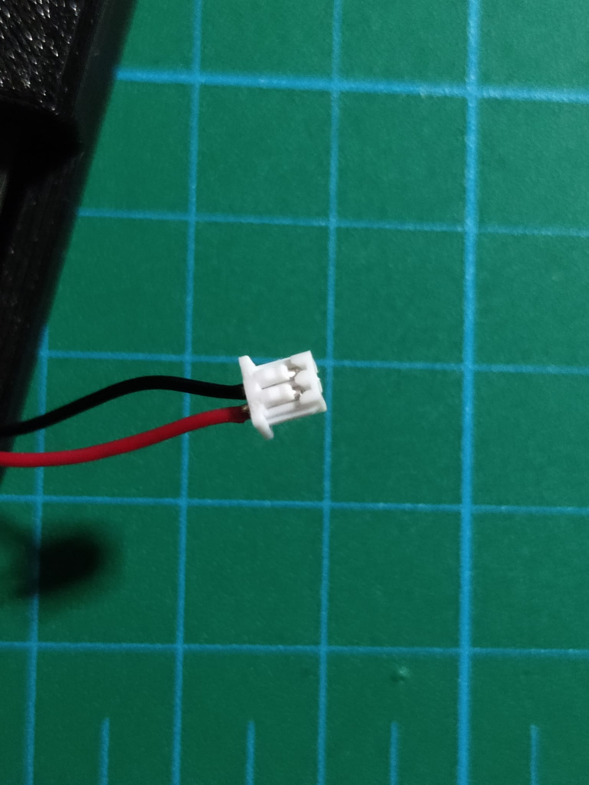

# Other components

This build needs a battery connector only if you have soldered the optional J1 connector only.

The materials that you  will need apart of  the BOM are described [here](../out-of-bom.md).

To mount the battery connector you should cut the wires at the appropiate length and crimp a cable terminator. First crimp the black cable:

Then you should insert the terminator into the connector housing:

Now do it with the red wire:

And add it to the connector:

Finally you have your battery connector ready!

You can continue with the [PCB](./pcb.md).
